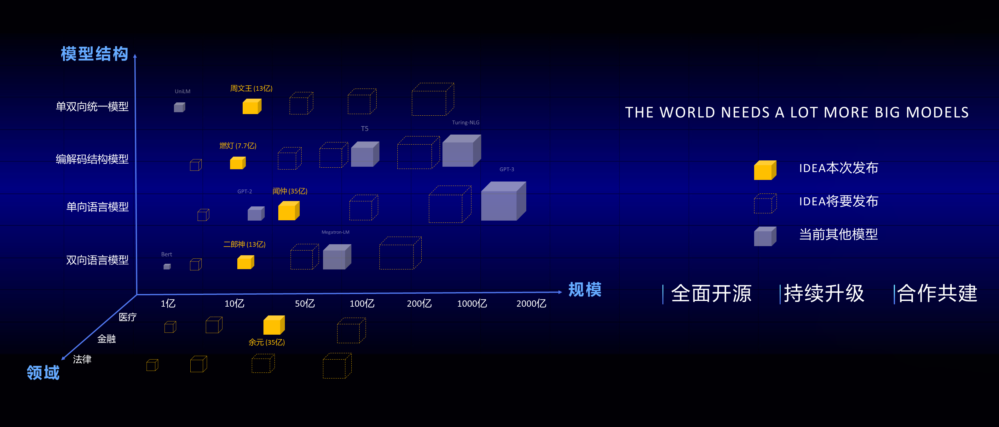

[**中文**](./README.md) | [**English**](./README_en.md)

# Fengshenbang-LM
最近两年，预训练逐渐成为整个认知智能的基础，自然语言和计算机视觉的算法全方面的依赖于预训练模型来构建。

预训练模型的规模从最初的1亿参数BERT到一千多亿参数的GTP-3，正在以每年10倍的速度增加。针对不同的下游任务，我们需要不同的结构，不同的尺寸和不同的专业领域的预训练模型。
这个世界需要更多更大的模型。但是，有限的算力资源是限制整个领域进一步发展的瓶颈。尤其是高校、小公司和一些传统公司，根本不具备足够的算力来训练和使用大规模预训练模型。这些都阻碍了整个人工智能技术更进一步的落地。

这个世界需要一个答案。

IDEA研究院正式宣布，我们开启 “封神榜”大模型开源计划。在这个计划中，我们全方面的开源一系列的自然语言预训练大模型，它们将覆盖不同的模型结构、不同的模型尺寸、不同的专业领域。而且我们承诺，我们将对这些模型做持续的升级，不断融合最新的数据和最新的训练算法。通过我们IDEA研究院的努力，我们打造中文认知智能的通用基础设施，避免重复建设，我们为全社会节省算力。



同时，我们也希望各个公司、高校、机构加入到这个开源计划中，一起共建大模型开源体系。未来，当我们需要一个新的预训练模型，都应该是首先从这些开源大模型中选取一个最接近的，做继续训练，然后再把新的模型开源回这个体系。这样，每个人用最少的算力，就能得到自己的模型，同时这个开源大模型体系也能越来越大。


为了更好的体验，拥抱开源社区，封神榜的所有模型都转化并同步到了Huggingface社区，你可以通过几行代码就能轻松使用封神榜的所有模型，欢迎来[IDEA-CCNL的huggingface社区](https://huggingface.co/IDEA-CCNL)下载。
  
## 二郎神系列

Encoder结构为主的双向语言模型，专注于解决各种自然语言理解任务。
13亿参数的二郎神-1.3B大模型，采用280G数据，32张A100训练14天，是最大的开源中文Bert大模型。2021年11月10日在中文语言理解权威评测基准FewCLUE 榜单上登顶。其中，CHID(成语填空)、TNEWS(新闻分类)超过人类，CHID(成语填空)、CSLDCP(学科文献分类)、OCNLI(自然语言推理)单任务第一，刷新小样本学习记录。二郎神系列会持续在模型规模、知识融入、监督任务辅助等方向不断优化。


### 模型下载地址
[Huggingface 二郎神-1.3B](https://huggingface.co/IDEA-CCNL/Erlangshen-1.3B)

### 模型加载
``` python
from transformers import MegatronBertConfig, MegatronBertModel
from transformers import BertTokenizer

tokenizer = BertTokenizer.from_pretrained("IDEA-CCNL/Erlangshen-1.3B")
config = MegatronBertConfig.from_pretrained("IDEA-CCNL/Erlangshen-1.3B")
model = MegatronBertModel.from_pretrained("IDEA-CCNL/Erlangshen-1.3B")

```
### 使用示例
为了便于开发者快速使用我们的开源模型，这里提供了一个下游任务的finetune示例脚本，使用的[CLUE](https://github.com/CLUEbenchmark/CLUE)上的afqmc语义匹配任务数据，运行脚本如下。其中DATA_PATH为数据路径，afqmc任务数据的[下载地址](https://github.com/CLUEbenchmark/CLUE)，PRETRAINED_MODEL_PATH为预训练模型的路径。你可以从HuggingFace把模型下载到本地路径，然后令PRETRAINED_MODEL_PATH等于你的模型存储路径。若你不想下载模型，可以令`PRETRAINED_MODEL_PATH="IDEA-CCNL/Erlangshen-1.3B"`，提供的脚本会自动下载模型到本地。
``` sh
python example/finetune.py " \
        --train_data_path $TRAIN_DATA_PATH \
        --dev_data_path $DEV_DATA_PATH \
        --test_data_path $TSET_DATA_PATH \
        --pretrained_model_path $PRETRAINED_MODEL_PATH \
        --checkpoints ./model.pth \
        --output_path ./afqmc_predict.json \
        --log_file_path ./finetune.log \
        --batch_size 32 \
        --learning_rate 0.00002 \
        --max_length 64 \
        --epoch 7 \
        --model_type megatron \
            "
```
为了便于开发者在开源模型的基础上继续做任务相关的预训练，这里提供了一个继续预训练的pretraining脚本，运行脚本如下：
``` sh
python example/pretraining.py " \
        --train_data_path $TRAIN_DATA_PATH \
        --dev_data_path $DEV_DATA_PATH \
        --test_data_path $TSET_DATA_PATH \
        --pretrained_model_path $PRETRAINED_MODEL_PATH \
        --checkpoints ./model.pth \
        --output_path ./afqmc_predict.json \
        --log_file_path ./pretraining.log \
        --batch_size 128 \
        --learning_rate 0.00002 \
        --max_length 64 \
        --epoch 135 \
        --model_type megatron \
            "
```


### 下游效果
|     模型   | afqmc    |  tnews  | iflytek    |  ocnli  |  cmnli  | wsc  | csl  |
| :--------:    | :-----:  | :----:  | :-----:   | :----: | :----: | :----: | :----: |
| roberta-wwm-ext-large | 0.7514      |   0.5872    | 0.6152      |   0.777    | 0.814    | 0.8914    | 0.86    |
| 二郎神-1.3B | 0.7608      |   0.5996    | 0.6234      |   0.7917    | 0.81    | 0.9243    | 0.872    |

## 周文王系列

IDEA研究院认知计算中心联合追一科技有限公司的新结构大模型。该模型在训练阶段就统一考虑LM（Language Model）和MLM（Mask Language Model）任务，增加了旋转位置编码技术，让模型同时具备生成和理解的能力。目前已有13亿参数的周文王-1.3B大模型，是中文领域同时做LM和MLM任务最大的模型，会持续在模型规模、知识融入、监督任务辅助等方向不断优化。


### 模型下载地址

[Huggingface 周文王-1.3B](https://huggingface.co/IDEA-CCNL/Zhouwenwang-1.3B)<br>
[Huggingface 周文王-110M](https://huggingface.co/IDEA-CCNL/Zhouwenwang-110M)
### 模型加载
由于我们现在的周文王结构是在追一科技之前的roformer结构进行的修改，而HuggingFace还没有周文王的模型结构。因此需要从本仓库导入[model](model)文件夹到你自己的工程根目录下。导入之后，即可按照下面的脚本从huggingface下载并加载对应的模型：

``` python
from model.roformer.modeling_roformer import RoFormerModel            #从本仓库提供的roformer文件中导入roformer模型
from model.roformer.configuration_roformer import RoFormerConfig
from transformers import AutoTokenizer

tokenizer = AutoTokenizer.from_pretrained('IDEA-CCNL/Zhouwenwang-110M')
config = RoFormerConfig.from_pretrained('IDEA-CCNL/Zhouwenwang-110M')
model = RoFormerModel.from_pretrained('IDEA-CCNL/Zhouwenwang-110M')
```


### 使用示例

``` sh
python example/finetune.py " \
        --train_data_path $TRAIN_DATA_PATH \
        --dev_data_path $DEV_DATA_PATH \
        --test_data_path $TSET_DATA_PATH \
        --pretrained_model_path $PRETRAINED_MODEL_PATH \
        --checkpoints ./model.pth \
        --output_path ./afqmc_predict.json \
        --log_file_path ./finetune.log \
        --batch_size 32 \
        --learning_rate 0.00002 \
        --max_length 64 \
        --epoch 7 \
        --model_type roformer \
            "
```

### 下游效果

#### 自然语言理解
使用周文王-1.3B模型进行自然语言理解任务时，需要将token_type全部设置为0。周文王的下游任务表现如下：

|     模型   | afqmc    |  tnews  | iflytek    |  ocnli  |  cmnli  | wsc  | csl  |
| :--------:    | :-----:  | :----:  | :-----:   | :----: | :----: | :----: | :----: |
| roberta-wwm-ext-large | 0.7514      |   0.5872    | 0.6152      |   0.777    | 0.814    | 0.8914    | 0.86    |
| 周文王-1.3B | 0.7463     |   0.6036    | 0.6288     |   0.7654   | 0.7741    | 0.8849    | 0. 8777   |

#### 自然语言生成
使用周文王-1.3B模型进行自然语言生成任务时，需要将token_type全部设置为1。周文王的生成例子如下：

```python
from model.roformer.modeling_roformer import RoFormerModel
from transformers import AutoTokenizer
import torch
import numpy as np

sentence = '清华大学位于'
max_length = 32

tokenizer = AutoTokenizer.from_pretrained('IDEA-CCNL/Zhouwenwang-110M')
model = RoFormerModel.from_pretrained('IDEA-CCNL/Zhouwenwang-110M')

for i in range(max_length):
    encode = torch.tensor(
        [[tokenizer.cls_token_id]+tokenizer.encode(sentence, add_special_tokens=False)]).long()
    logits = model(encode)[0]
    logits = torch.nn.functional.linear(
        logits, model.embeddings.word_embeddings.weight)
    logits = torch.nn.functional.softmax(
        logits, dim=-1).cpu().detach().numpy()[0]
    sentence = sentence + \
        tokenizer.decode(int(np.random.choice(logits.shape[1], p=logits[-1])))
    if sentence[-1] == '。':
        break
print(sentence)

 ```


## 闻仲系列
Decoder结构为主的单向语言模型，是一系列强大的生成模型。
35亿参数的闻仲-3.5B大模型，采用100G数据，256张A100训练28小时。

### 模型下载地址
[Huggingface 闻仲-3.5B](https://huggingface.co/IDEA-CCNL/Wenzhong-3.5B)

### load model
```python 
from transformers import GPT2Tokenizer, GPT2Model
tokenizer = GPT2Tokenizer.from_pretrained('IDEA-CCNL/Wenzhong-3.5B')
model = GPT2Model.from_pretrained('IDEA-CCNL/Wenzhong-3.5B')
text = "Replace me by any text you'd like."
encoded_input = tokenizer(text, return_tensors='pt')
output = model(**encoded_input)
```
### generation
```python
from transformers import pipeline, set_seed
set_seed(55)
generator = pipeline('text-generation', model='IDEA-CCNL/Wenzhong-3.5B')
generator("北京是中国的", max_length=30, num_return_sequences=1)

```


## 燃灯
Transformer结构为主的编解码语言模型，7.7亿参数的燃灯-770M大模型，采用280G数据，16张A100训练14天。

### 模型下载地址
[Huggingface 燃灯-770M](https://huggingface.co/IDEA-CCNL/Randeng-770M/)

### 模型加载
由于T5结构的燃灯-770M模型是基于Megatron进行训练的，而Megatron的T5模型结构与HuggingFace的T5模型结构有略微的区别，不能直接使用HuggingFace的T5模型进行导入。因此需要从本仓库导入[model](model)文件夹到你自己的工程根目录下。导入之后，即可按照下面的脚本从huggingface下载并加载对应的模型：

``` python
from model.megatron_t5.modeling_megatron_t5 import T5ForConditionalGeneration
from model.megatron_t5.configuration_magetron_t5 import T5Config
from model.megatron_t5.tokenization_megatron_t5 import T5Tokenizer

tokenizer = T5Tokenizer.from_pretrained('IDEA-CCNL/Randeng-770M')
config = T5Config.from_pretrained('IDEA-CCNL/Randeng-770M')
model = T5ForConditionalGeneration.from_pretrained('IDEA-CCNL/Randeng-770M')
```

### 使用示例

#### 下游任务使用示例
``` sh
python example/finetune.py " \
        --train_data_path $TRAIN_DATA_PATH \
        --dev_data_path $DEV_DATA_PATH \
        --test_data_path $TSET_DATA_PATH \
        --pretrained_model_path $PRETRAINED_MODEL_PATH \
        --checkpoints ./model.pth \
        --output_path ./afqmc_predict.json \
        --log_file_path ./finetune.log \
        --batch_size 32 \
        --learning_rate 0.00002 \
        --max_length 64 \
        --epoch 7 \
        --model_type megatron_t5 \
            "
```
#### 生成任务使用示例

```python
from model.megatron_t5.modeling_megatron_t5 import T5ForConditionalGeneration
from model.megatron_t5.tokenization_megatron_t5 import T5Tokenizer

tokenizer = T5Tokenizer.from_pretrained('IDEA-CCNL/Randeng-770M')
model = T5ForConditionalGeneration.from_pretrained('IDEA-CCNL/Randeng-770M')

output = model.generate(tokenizer.encode(tokenizer.encode('北京是中国的<extra_id_0>')))
print(tokenizer.decode(output))

```


## 余元
医学领域的余元系列，35亿参数余元-3.5B大模型，采用50G的医疗领域数据和知识，在已有的通用模型基础上继续训练，32张A100训练7天，是目前最大的开源GPT2医疗大模型。我们的模型在医学领域的事实判断中具有近90%的准确率。

我们利用余元-3.5B大模型实现事实判断，医学问答。更多的可能性等着你去发现。


### 模型下载地址
[Huggingface 余元-3.5B](https://huggingface.co/IDEA-CCNL/Yuyuan-3.5B)

### load model
```python 
from transformers import GPT2Tokenizer, GPT2Model
tokenizer = GPT2Tokenizer.from_pretrained('IDEA-CCNL/Yuyuan-3.5B')
model = GPT2Model.from_pretrained('IDEA-CCNL/Yuyuan-3.5B')
text = "Replace me by any text you'd like."
encoded_input = tokenizer(text, return_tensors='pt')
output = model(**encoded_input)
```
### generation
```python
from transformers import pipeline, set_seed
set_seed(55)
generator = pipeline('text-generation', model='IDEA-CCNL/Yuyuan-3.5B')
generator("Diabetics should not eat", max_length=30, num_return_sequences=1)

```

## 引用
```
@misc{Fengshenbang-LM,
  title={Fengshenbang-LM},
  author={IDEA-CCNL},
  year={2021},
  howpublished={\url{https://github.com/IDEA-CCNL/Fengshenbang-LM}},
}
```
## 联系我们


## License

[Apache License 2.0](LICENSE)
